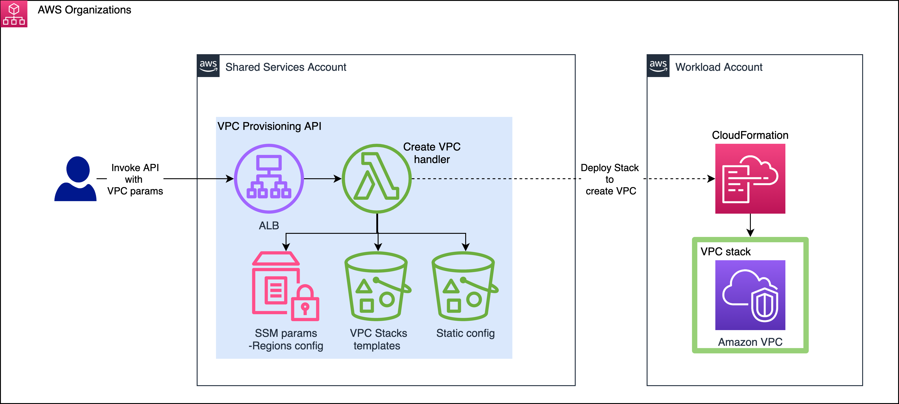
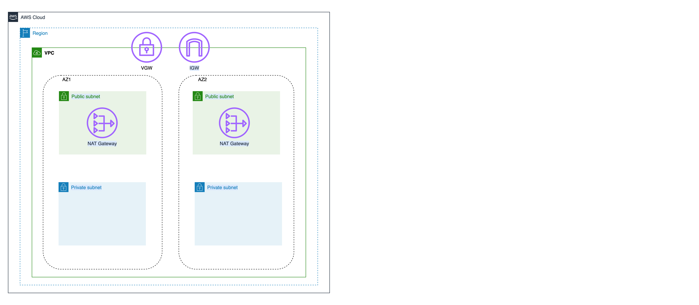

# Centralized VPC Provisioning API using AWS SAM CLI 

This project contains the AWS SAM template definition for a serverless API that is used to create standardized VPCs across workload accounts in a multi-account environment.
AWS SAM CLI is used to build the Lambda function as a Docker Container Image, publish it to ECR, and automate the deployment of the SAM application.
AWS SAM CLI automatically creates the required Amazon ECR repositories by using the 'sam deploy --guided' command.
AWS SAM CLI can authenticate with private ECR repositories using the **ecr-credentials-helper** and AWS credential profiles.

Lambda handler flow:
* Validate incoming VPC request.  Refer to the VpcContext (/vpc_core_infra/vpcx_cdk/vpc_context.py) class for validation conditions.
* Validate subnet sizes.
* Validate subnet counts and subnet configurations.
* Set VGW connectivity
* Generate a CDK stack template.  Refer to the vpc_stack (/vpc_core_infra/vpcx_cdk/vpc_stack.py) code for orchestration details.
* Public and private subnets (must use all available AZs in a region).
* If subnets are not explicitly defined (i.e., CIDR blocks are fully specified), then the VPC service will auto-assign CIDRs to each subnet in equal sizes unless no public subnets are requested, in which case the VPC service will leave CIDR space for the inclusion of up to 2 future public subnets.
* Public and private route tables.  All primary VPCs are connected to a VGW.  All primary VPCs also have an S3 endpoint.
* Determine how many existing VPCs in a region exist.  Use this to derive the new VPC stack name.  VPC stacks are named vpc-<vpc_type>-<region_code><vpc_index>
* Synchronously deploy VPC stack

## Directory Structure
```
├── README.md                                   <-- This documentation file 
├── vpcx_core_infra                             <-- Directory containing lambda, and utils
          ├── utils                             <-- Utility functions
          ├── config                            <-- Env specific params
          ├── requirements.txt                  <-- Python dependencies
          ├── index.py                          <-- Lambda handler
          ├── Dockerfile                        <--- Lambda container image docker file             
├── samconfig.toml                              <-- SAM deploy default config file
└── template.yaml                               <-- SAM app definition file
```

## Architecture


## Basic default VPC deployed by API
User can provide additional parameters in the API request to create a customized(public/private subnet count, subnet cidrs) VPC



## Pre-requisites
    Install AWS CLI, AWS SAM CLI
    (Optional)Get an existing S3 bucket name for DEPLOYMENT_BUCKET, if you would like to re-use an existing bucket for the Serverless framework

## Dockerfile
```shell
Use AWS base image for python. Add nodejs runtime to the base image.
Add following metadata in the SAM template file so lambda is packaged as a container image and deployed by AWS SAM.

Metadata:
    Dockerfile: Dockerfile
    DockerContext: ./vpcx_core_infra
    DockerTag: python3.8-v1
````

## Build lambda image and invoke lambda locally
```shell

# Build image 
sam build --cached

# View the Lambda container image under docker images
docker images

# Invoke lambda on local
cat << 'EOF' > test_event.json 
{
  "account_alias": "017513",
  "cloud_provider": "AWS",
  "vpc_type": "primary",
  "vpc_top_level_cidr": [
    "192.168.0.0/16"
  ],
  "subnets": {
    "private_blocks": [
      "192.168.0.0/24",
      "192.168.1.0/24",
      "192.168.2.0/24"
    ]
  },
  "region": "us-west-2",
  "connectivity_type": "vgw"
}
EOF

sam local invoke -e test_event.json

```

## Configuration required in Deployment Account

```shell
# Install ECR credentials plugin
# Instructions for installing the helper - https://github.com/awslabs/amazon-ecr-credential-helper
brew install docker-credential-helper-ecr  # mac OS

# Create AWS named profiles
aws configure --profile default # default account = 2222, SAM application deployment account
aws configure --profile dev  # dev account = 1111, target test account

# Set required config params in config/config.dev.json:
SUBNETS: [
    "subnet-7cc55a1",
    "subnet-c0dc330a2"
  ]
SECURITY_GROUPS: [
    "sg-de1392"
  ]
  
DEPLOYMENT_BUCKET: "dev-account-provisioning-lambda-package"
STATIC_CF_TEMPLATE_BUCKET: "dev-account-provisioning-static-cf-templates"
METADATA_TEMPLATE_BUCKET: "dev-account-provisioning-vpc-metadata"
   
# Upload network config to S3 
aws s3 cp ./vpc_core_infra/templates/networking_config.json s3://${STATIC_CF_TEMPLATE_BUCKET}/networking_config.json

# Create SSM param for the region level config params
aws ssm put-parameter \
    --name "/vpcx/aws/regions/us-west-2" \
    --value "{\"master-cidr\": {\"AWS\": {\"cidrs\": [\"192.168.0.0/16\"] } },\"tgw-available\": false}" \
    --type String 
 
```

## Configuration required in Target Test Account
```shell
# Create IAM Role 'vpcx_admin_role' with Administrator Access in dev account (profile=dev), and set default account as a Trusted Entity 
cat << 'EOF' > Vpcx-Role-Trust-Policy.json 
{
  "Version": "2012-10-17",
  "Statement": [
    {
      "Effect": "Allow",
      "Principal": {
        "AWS": "arn:aws:iam::2222:root"
      },
      "Action": "sts:AssumeRole",
      "Condition": {}
    }
  ]
}
EOF

aws iam create-role --role-name 'vpcx_admin_role' --assume-role-policy-document file://Vpcx-Role-Trust-Policy.json --profile dev

cat << 'EOF' > AdminPolicy.json
{
    "Version": "2012-10-17",
    "Statement": [
        {
            "Effect": "Allow",
            "Action": "*",
            "Resource": "*"
        }
    ]
}
EOF

aws iam put-role-policy --role-name 'vpcx_admin_role' --policy-name AdminAccess --policy-document file://AdminPolicy.json --profile dev
```

## Deployment
```shell

# Install dependencies
cd vpc-provisioning-api-docker-sam

# 'sam deploy' command will publish the lambda container image to ECR repository and deploy the cloudformation stackset for the application
# make sure ecr-credential-helper is installed on PATH

sam deploy --guided

===============================================================================================================================================
Configuring SAM deploy
======================

        Looking for config file [samconfig.toml] :  Not found

        Setting default arguments for 'sam deploy'
        =========================================
        Stack Name [sam-app]: hello-world-app
        AWS Region [us-east-1]: us-east-1
        Image Repository []: <accountID>.dkr.ecr.<region>.amazonaws.com/hello-world-container        Confirm changes before deploy [y/N]: n
        Allow SAM CLI IAM role creation [Y/n]: y
        HelloWorldFunction may not have authorization defined, Is this okay? [y/N]: y
        Save arguments to configuration file [Y/n]: y
        SAM configuration file [samconfig.toml]:
        SAM configuration environment [default]:
===============================================================================================================================================

```

## Integration Tests
```shell
# Run integration tests after API is deployed. 
# boto3 uses credentials in the aws default profile, make sure AWS default profile is configured
# Set context.hostname in bdd/environment.py
# Set profile_name in bdd/environment.py
export ENV=dev
behave vpc_core_infra/test/bdd/vpc_basic.feature 
``` 

## Example API request to create a VPC in test account
```bash
# Create VPC in account=account_alias
cat << 'EOF' > data.json
{
  "account_alias": "1111",
  "cloud_provider": "AWS",
  "vpc_type": "primary",
  "vpc_top_level_cidr": [
    "192.168.0.0/16"
  ],
  "subnets": {
    "private_blocks": ["192.168.0.0/24", "192.168.1.0/24", "192.168.2.0/24"]
  },
  "region": "us-west-2",
  "connectivity_type": "vgw"
}
EOF

curl  -X POST
      -d "@data.json"
      -H 'Content-Type: application/json' 
       http://$LoadBalancerDnsName
```

## License

This library is licensed under the MIT-0 License. See the LICENSE file.